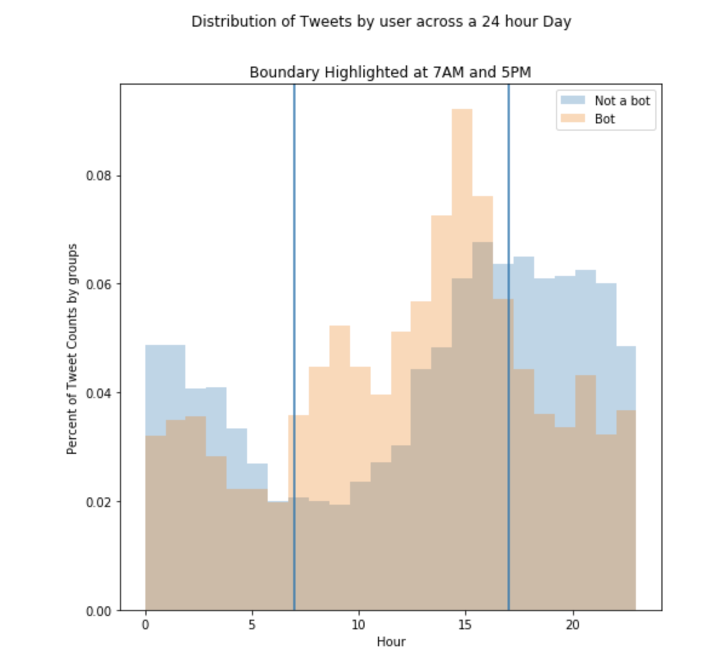
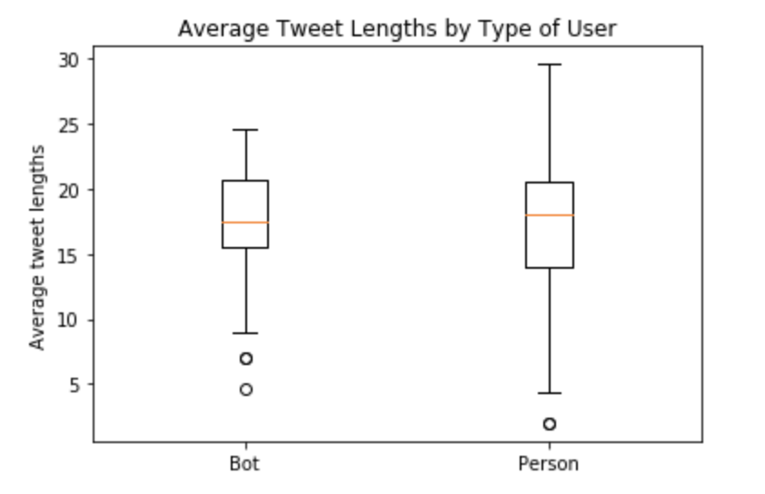
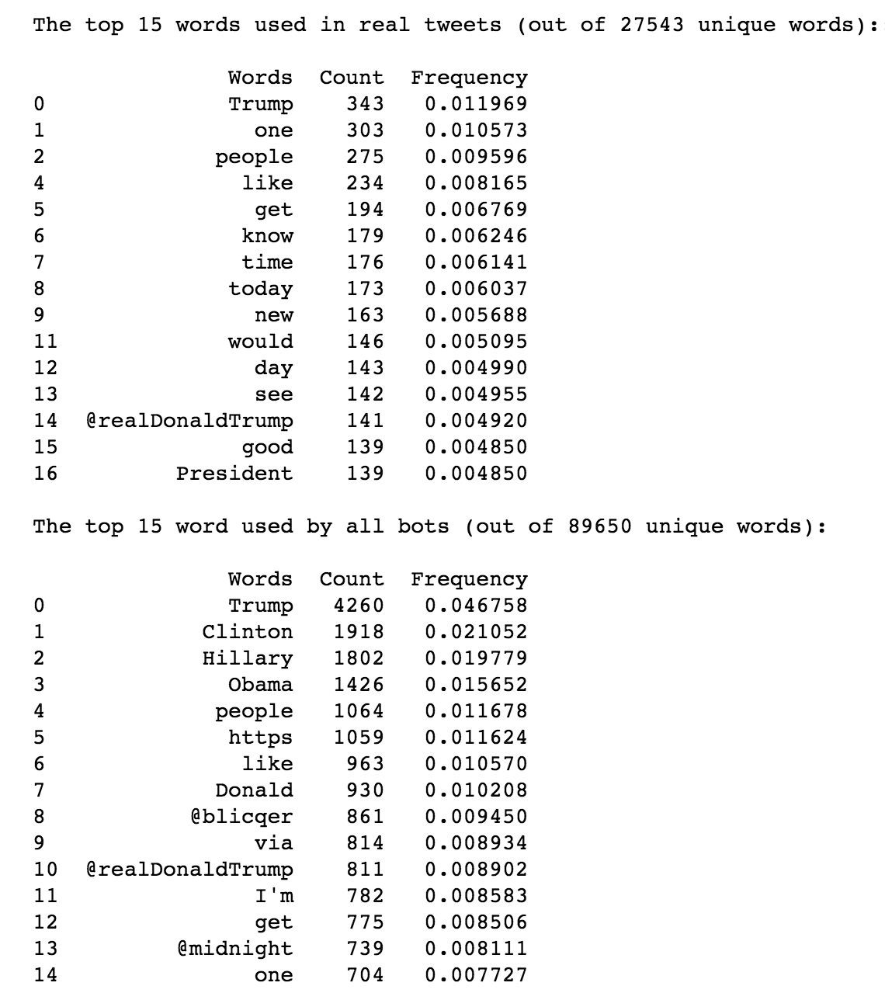

# Exploratory Data Analysis (EDA)

After obtaining and cleaning our data and adding NLP attributes to each tweet, we performed Exploratory Data Analysis.  Below are several charts and corresponding explanations.

*Diagram:  Time of Tweet Analysis*

Our reading of others’ research suggests that patterns of tweeting throughout the day
are indicative of bot vs. non-bot behavior. The following chart was one attempt to gain
intuition of potentially different behavior between the classes. The chart shows tweets
for each of class of user in separate colors and plots the occurrence of a tweet by minute
of the hour vs. hour of the day. We do not discern any useful pattern with this type of
analysis yet.

*Diagram:  Time of Day Tweet Analysis*

Another attempt at capturing the tweet activity was captured above: here the tweets are counted across the hours of the day, in UST, posted. A aspect this figure captures is the heightened posting rates by bots that occur right after real people stop posting. This pattern appears reflexive, as if informtion is being farmed by real posted and churned back (either retweets or recaptured in a different tweet) by the bots. However why this is happening is just speculation - what we can say for certain is that the bot's activity trails real people's posting rates.

*Diagram:  NLP Topic Count Analysis*

In this diagram, we look at the distribution by class of each user’s average tweet topic
count (i.e., for each user, we calculate the average topic count across all of that user’s
tweets and then plot the distribution). It appears bots tweet within a slightly narrower
IQR of this measure.

*Diagram:  NLP Sentiment Analysis*

In this diagram, we look at the distribution by class of each user’s average tweet
sentiment score (i.e., for each user, we calculate the average sentiment score across all of
that user’s tweets and then plot the distribution). It appears bots tweet within a slightly
narrower IQR of this measure, with a median and many outliers that are much more
negative.

*Diagram:  NLP Tweet Length Analysis*

It is shown above that there's more variability in real people's sentences; this means people are having short and long conversations with huge variability in the length of their tweets. Bots however are having much more consice conversations of which 75% are 16-20 word length. Real people have 13-23 words in their tweets, on average.

This is an excellent place to begin classification but it's only one parameter. A much richer series of parameters should be constructed before employing any classification. The next idea saught was to examine the vocabulary choices. Below the top 15 words per group, bot and real person, are shown:

*Diagram:  Frequent Word Usage*

There's a distinction between these groups: bots love discussion Trump, Clinton, and Obama, at over 4x (Trump) the frequency of real people. Real people weren't discussing Clinton nor Obama! It was decided to use the bot's favorite words for classification - if the tweeter is tweeting frequently about these topics, we could assume they have an agenda. The frequency of the top 10 words used by bots were engineered for classification across both groups. If it talks like a bot, it might just be a bot.

[Go to next page](5-FeatureEngineering)
