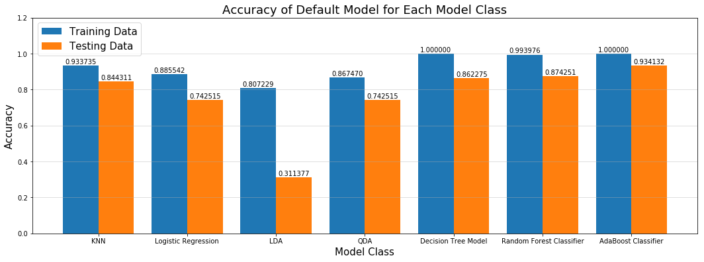
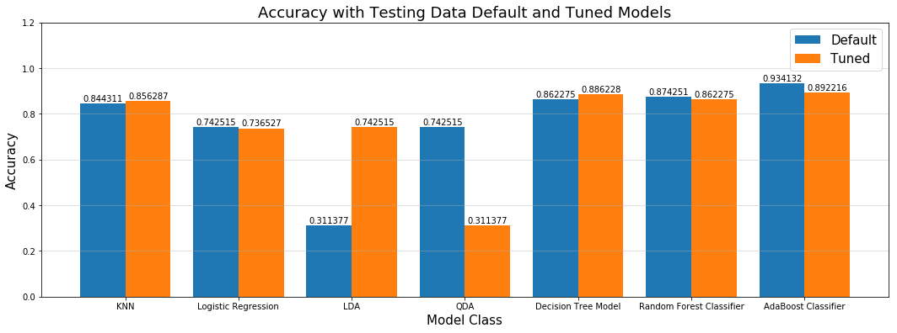
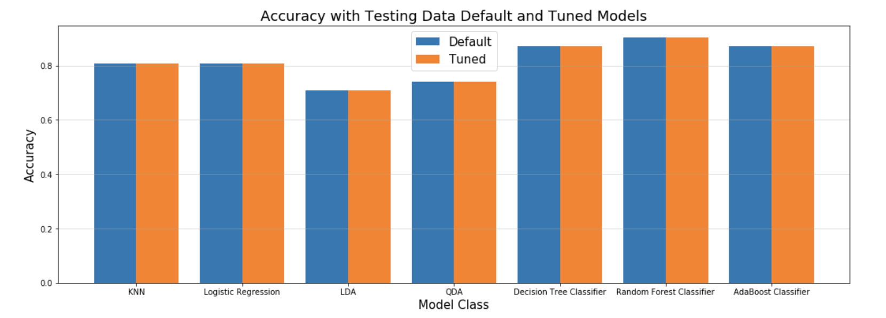

# MODELING

**Overview**

The modeling we conducted mirrored the modeling we performed in our later assignments, involving many classes of models.  The following diagram is an overview of our approach and is described below:
- Using the enriched user data (with train/test split), we fit a base model on each of seven model classes using sklearn's **default settings**.
- Using SearchGridCV, we tuned a model from each of the classes to determine the benefit of **tuning**.
- We used the tuned models from each class to form an ensemble.  The output from each ensemble member was fed to a tuned **Random Forest meta-model**.
- We followed a similar approach to the above using the lower level tweet data enriched with NLTK features.
- We created a **neural network** to compete with the meta-models.
- We also created an MLPClassifier model to compete with the Neural Net.
- We compared results (i.e., best tuned vs. meta-model vs. neural network, etc.).

*Diagram:  Overview of Modeling Efforts*

**Data Sets for Modeling with User Level Data**

As explained above, the size of our data did decrease substantially as we cleaned and rolled-up to the Twitter user level.  As is noted many times in this report, more data would make our results more meaningful.  Nonetheless, we tried to follow the correct process at each step as best possible.

After we had the enriched user level data, we split our data into a training set and a testing set.  Given the small number of users, we had to split our data 50/50.  This resulted in data sets with the following sizes:
- Training data:  117 verified users and 52 bots
- Testing data:  118 verified users and 52 bots

Each data set had the same features for each Twitter user that is described above and re-stated below:
- count_tweets
- nlp_count_key_phrase
- nlp_sentiment_score
- is_tweet percent
- follower_count
- avg_intertweet_time
- avg_text_length

Prior to modeling, we did discover a lingering problem with 'NaN' values in the followers_count column.  We 'filled-in' these holes with the mean from other rows in this column. 

**Default Model Bake-off**

To get the ball rolling, we trained each of 7 models on the training data using the default settings for each model class provided by sklearn.  We then scored each model on the testing data and reported the training and testing results for each model with default settings.  The results are in the diagram below:

*Diagram:  Results of Default Model Bake-off*

It was good to see that each model did perform better on the training data (i.e., the lack of tuning did lead to overfitting with the training data.)  The biggest drop-off between training and testing was with the X model.

The overall winner in the bake-off among the default models was AdaBoost with a score of 94%.

**Tuning Models**

Each of the different classifiers in sklearn has a myriad of tuning options. Some more than others.  Best practice is to optimize or tune each model by comparing/scoring a number of setting combinations with cross-validation data.  A very powerful way to make this comparison with cross-validation data across a large parameter-space is with GridSearchCV, where GridSearchCV accepts as arguments one or more model types and very flexible list(s) of argument(s) that correspond to each model type.  GridSearchCV perform cross validation for each combination of parameters for each model type specified and reports back relevant results.

We used GridSearchCV to tune each model type with the best combination of parameters.  We then fit the 'best-in-class' version of that model type on the training data and scored on the testing data.  The chart below shows the accuracy scores that resulted for these tuned models vs. their default/untuned counterparts that were described above:

*Diagram: Results of Model Tuning*

As the diagram shows, in some instances tuning does improve the performance of the model over the model with default parameters specified by sklearn.  In other cases, however, we saw a *slight decline* when comparing the accuracy score of the tuned model selected by GridSearchCV with the model that used default parameters from sklearn.  We did ensure the set of parameters used by GridSearchCV included the default options specified by sklearn.  The root problem is likely the small amount of training data out of which GridSearchCV is creating cross-validation data.

The overall winner in the bake-off among the tuned models was AdaBoost with a score of 89%.

**Ensembling**

In an effort to improve upon the predictive ability of any one model, we created a meta-model trained on the predictions from the 7 'best-in-class' models described in the previous section.  The following describes our approach in more detail:
- We fit each of the tuned models in the ensemble on the training data.  **If we had more data, we would have performed this training step on new, tuning data.**  As noted elsewhere, lack of data was a project limitation.  So, in this case, we decided to re-fit on training data with the known deficiency that the tuned models have already learned as much as possible from the training data, limiting the potential improvement of this ensembling technique.
- We created predictions (as probabilities rather than as class labels) with each model and stored in an ensemble_train dataframe (one row per observation in training data, one column per model in the ensemble).  This ensemble_train dataframe will become the *X's* data matrix when we fit the meta-model next.
- Due to its generally strong performance, we chose the RandomForestClassifier as the model type for our meta-model.  We fit the meta-model on the ensemble_train data described above (i.e., on the predictions from the ensemble of models).  We used GridSearchCV again to tune the RandomForest meta-model.
- We created predictions (as labels, not probabilities) using the RandomForest meta-model from the testing data.
- We then scored these predictions for accuracy against the known testing labels.

The meta-model did achieve an accuracy score of 90% on the testing data.  This score was just slighlty higher than the best contributing model in the ensemble.

**NLTK Results**

*Diagram: Results of Hand-Made NLP Features*

Employing the ensemble to the hand-engineered NLP features, a maximum score shy over 85% was achieved with the Random Forest Classifier, followed by the Adaboost Classifier. These results are not nearly as strong as the same emseble run with the Microsoft Azure generated features, which scored around 90% across all classifiers. While an excellent option for the broke student, the features obtained from processing through Microsoft Azure's NLP API was much richer, thereby producing better results, from 5 to 15%. 

On a small scale, such as a final project, these results may be fine. However, an investor purchasing expensive ad space on websites interested in marketting products to specific, potential clients, I would recommend utilizing Microsoft Azure for a minimum ROI of 5% to a maximum of 15% on targetting. 

**Neural Networks**

An additional modeling effort was to create a neural network using Keras libraries.  In this implementation, we made a small number of design decisions:
- We converted our response variable labels to categorical using Keras' 'to_categorical' function.
- We scaled our X_train and X_test data matrices using Python's 'MinMaxScaler()' function.
- We created neural network model with several layers and many nodes:
  - Since our data matrix had 7 features, the first layer specified input_shape = (7,).
  - Since our predictions were binomial classifications, our output layer was specified as Dense(2, activation='softmax').
  - We chose 'relu' as the activation type for all other nodes.
- We compiled the model using 'binary_crossentropy' as our loss function and 'adam' as our optimizer.

We fit the model on the scaled training data with 50 epochs.  We scored for accuracy on the scaled testing data.  After re-running several times, we noticed the accuracy score was rather volatile, implicitly varying due to random initial conditions controlled by Keras.  The overall accuracy score of 69% was the lowest of the models in this project, confirming an intuition that neural network success is dependent on significiantly larger sizes of data on which to train.

**MLP Classifier**

Lastly, we also applied MLPClassifier to our data. This model is based on the similar concept of the above-proposed Neural Networks. It gave us a comparable classification accuracy (0.69).  It also appeared to vary significant run-to-run, unlike the earlier models.

[Go to next page](7-Conclusion)
