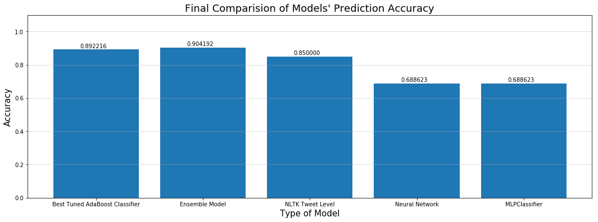
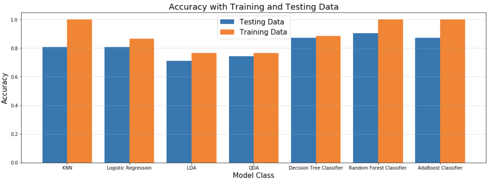

# CONCLUSION

In our final bakeoff, our highest prediction accuracy was achieved with the Ensemble model based on user level enriched data.  The differnce between the best score and the second best score from the tuned AdaBoost model was very small.  In fact, in many runs the results were reversed. 

Our hand-made system was a little less successful, capable of only achieving a maximum of 80% accuracy. Below are the results from the analysis conducted using NLTK:

Overall our methods were pretty successful. The neural network developed inhouse certainly wasn't optimal, perhaps hindered by lack of data. From a business perspective, if money allows, Azure would make a great addition to an NLP pipeline to add an additional 10% accuracy to the models we employed. Otherwise, a hand-coded NLP classifier system can easily achieve a minimum score of 80%!

It is interesting that our models were able to predict classifications.  It is also interesting that with these non-parametric models, our ability to say more about why or how seems limited and drives home a point made repeatedly in class.

**Future Considerations**

This project would clearly benefit from additional time.  We found the effort very educational.  We also know there are many things we could improve upon with more time and experience in the future.  Here are some of those areas for improvement:
- Getting access to more verified users in a more scalable, automated way would help.  Perhaps we just missed an obvious solution, but selected verified users individually off the Twitter application was the best we could come up.  
- Getting access to known 'non-bot' users who are not verified might also add richness to the analysis.  One idea would be to collect Twitter user names of friends and family from a large group of students.  This would have the benefit of a more diverse set of users as opposed to verified users who tend to be 'famous' and might share patterns of behavior.
- We did not use all the attributes available to us from Twitter itself.  This includes fields at the user level as well as additional objects related to a tweet such as URL, hashtags, etc.  With more time to design and iterate, we would have done this.
- Our modeling did include a feature that in retrospect might have introduced bias:  the number of tweets per user.  The data source for bots probably provided more tweets per bot user, so this probably explains our better than expected results.  Focusing on number of tweets in a fixed time period would be an obvious improvement.
- Lastly, the NLTK analysis of common words among bots can provide insight but could require more frequent training as vocabularly and topics change.

**Resources**

The notebooks and data files developed as part of this project are submitted separately for examination and are available on our GitHub site listed here:  https://github.com/eumarassis/Harvard-s109-TwitterBotDetection

The diagram below provides a graphical view of how the notebooks and data are ogranized.  The items in yellow represent the data and files that can be easily loaded and run to produce the modeling output above.

*Diagram:  Notebooks and Data Pipeline*

If you do wish to run the data collection notebooks that collect data directly from Twitter, include in your directory a file called 'twitter_credentials.py' with the following entries for Twitter access tokens (as these are non-valid samples):

- ACCESS_TOKEN = "788577624-gX0BBIyarNDkjaSR14HQWnahPMdkdjfbounHczrsYa"
- ACCESS_TOKEN_SECRET = "dlE3C4bmeVj1D5DUh78akkj87U6ynDbUY3MsR5x6IQxkqex"
- CONSUMER_KEY = "uzCvIpZdtdgRddARDyoyZIlslLav"
- CONSUMER_SECRET = "CkBecojZScyZG788KGlzuuq6H11RfbcdwTA7nw5UYuwC7JOIU990Bv"

We read material at the following links as research during the planning and EDA phase of our project:

- [http://www.icir.org/vern/papers/pam11.autotwit.pdf](http://www.icir.org/vern/papers/pam11.autotwit.pdf)
- [https://theintercept.com/2018/03/16/twitter-bot-detector-software/](https://theintercept.com/2018/03/16/twitter-bot-detector-software/)
- [https://thenextweb.com/socialmedia/2017/11/02/tool-tells-youre-arguing-twitter-propaganda-bot/](https://thenextweb.com/socialmedia/2017/11/02/tool-tells-youre-arguing-twitter-propaganda-bot/)
- [https://medium.com/@robhat/identifying-propaganda-bots-on-twitter-5240e7cb81a9](https://medium.com/@robhat/identifying-propaganda-bots-on-twitter-5240e7cb81a9)
- [https://botometer.iuni.iu.edu/#!/](https://botometer.iuni.iu.edu/#!/)
- [https://dzone.com/articles/applying-nlp-to-tweets-with-python](https://dzone.com/articles/applying-nlp-to-tweets-with-python)
